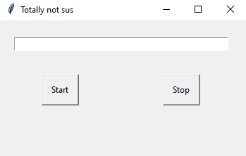

# Gaming Macro
## Introduction
This macro coded with python3. The purpose of it is to loop the key u enter into the input field. It only loop one key and at random interval from 0 to 2 seconds. If you get banned from the game I am not responsible for it.

It uses module:

 - pydirectinput 
 - time 
 - random 
 - tkinter
## Installation
No installation required unless if u run the python file itself. Run following command to install the modules if you are running the python file.

    pip3 install -r requirements.txt
## Games that work
I tested this out on:

 - Warframe

## Sample photo of the program
